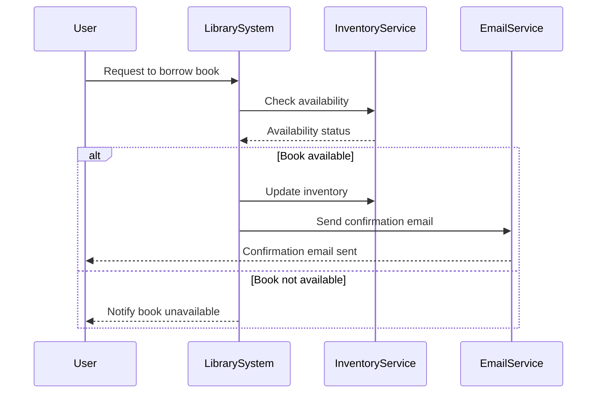

# COMP2511 Sample Exam 翻译与详解

## 目录
- [Q1](#q1)
- [Q2](#q2)
- [Q3](#q3)
- [Q4](#q4)
- [Q5](#q5)
- [Q6](#q6)
- [Q7](#q7)
- [Q8](#q8)
- [Q9](#q9)
- [Q10](#q10)
- [Q11](#q11)
- [Q12](#q12)
- [Q13](#q13)
- [Q14](#q14)
- [Q15](#q15)
- [Q16a](#q16a)
- [Q16b](#q16b)
- [Q16c](#q16c)
- [Q16d](#q16d)
- [Q16e](#q16e)
- [Q16f](#q16f)
- [Q17](#q17)
- [Q18](#q18)

## Multiple Choice
- [Question 1](#question-1)
- [Question 2](#question-2)
- [Question 3](#question-3)
- [Question 4](#question-4)
- [Question 5](#question-5)
- [Question 6](#question-6)
- [Question 7](#question-7)
- [Question 8](#question-8)
- [Question 9](#question-9)
- [Question 10](#question-10)
- [Question 11](#question-11)

## Short Answer
- [Short Answer Question 1](#short-answer-question-1)
- [Short Answer Question 2](#short-answer-question-2)
- [Short Answer Question 3](#short-answer-question-3)
- [Short Answer Question 4](#short-answer-question-4)
- [Short Answer Question 5](#short-answer-question-5)
- [Short Answer Question 6](#short-answer-question-6)
- [Short Answer Question 7](#short-answer-question-7)
- [Short Answer Question 8](#short-answer-question-8)

---

## Q1
### Question
A computer science student has many hopes and dreams.

The above relationship is an example of:  
A) Aggregation  
B) Composition  
C) Neither

### 中文逐字翻译
一名计算机科学学生拥有许多“希望与梦想”。

上述关系属于以下哪一种：  
A）聚合（Aggregation）  
B）组合（Composition）  
C）都不是

### 答案
A) Aggregation

### 解析（为什么选 A；B、C 不合适在哪）
- 选 **A 聚合**：描述是“学生拥有许多希望与梦想”。**希望/梦想**作为“部分”，其**存在不依赖于**“学生”这一“整体”的生命周期（学生不在了，希望/梦想这个抽象仍然可被视为独立概念），这符合**弱所有权**与**生命周期不绑定**的特征，因此是聚合。
- **B 组合不合适**：组合要求**强所有权**与**组合生命周期**（整体消亡 ⇒ 部分必消亡），典型如“房屋–房间”“身体–器官”。而“希望/梦想”明显不满足这种强依附关系。
- **C 都不是不合适**：这段话清晰表达了“整体（学生）—部分（希望/梦想）”的拥有关系，属于面向对象建模中的**整体–部分**范畴，不是“都不是”。

### 相关知识点（覆盖所有选项与题面名词）
- **Aggregation（聚合）**：空心菱形；弱所有权；部分可独立存在/复用；如“图书馆–书”“班级–学生”。
- **Composition（组合）**：实心菱形；强所有权；部分与整体同生共死；如“房屋–房间”“订单–订单行”。
- **判断技巧**：问自己——部分是否**必须**依赖整体生存？若必须 ⇒ 组合；若不必须 ⇒ 聚合。  
- **易错点**：很多“has many”都想当然被画成组合；要结合**生命周期**来判断，而不是看语义表面。

**聚合和组合的判断，本质上不是在讨论现实物理上的偶然可能性（比如器官移植这种特殊情况），而是基于领域建模的语义去看“整体-部分”的生命周期依赖。**  
**对于组合的强生命周期依赖**：部分的存在是依赖于整体的生命周期的，-**在领域语义下，整体消亡 → 部分必消亡**。  
**身体–器官**：在正常领域设定中，器官不会独立“存活”，它的存在就是为了服务这个身体。一旦这个身体“终结”，领域模型就认为它的器官也随之终结。  
**房屋–房间**：房间的存在定义依附于这个房屋。如果房屋被拆了，房间的概念也没了（你不会说“房间”还能自己漂浮着存在）。  
注意：-**现实中的特殊技术手段（如器官移植）** 在一般建模中会被看作-**“把器官从一个整体分离再组合到另一个整体”**——依旧符合“它必须属于某个整体”的设定。  
**对于聚合的弱生命周期依赖**：部分在领域语义中是独立实体，可以在不同整体间共享或存在于整体之外。  
**学生–希望/梦想**：希望和梦想在领域语义下是抽象的，可以独立描述、存储、转移（甚至一个希望可以被很多人拥有）。  
**图书馆–书**：书可以离开图书馆，去到另一个图书馆，或者被个人收藏。  
为什么“梦想”是聚合、“器官”是组合？  
在建模“学生–梦想”时，我们并不假设梦想的存在必须依赖于这个特定学生的生物存活状态——梦想是抽象的，可以被认为是一个可独立存储、描述、传递的对象（例如数据库记录、文字描述）。
在建模“身体–器官”时，器官是这个身体的组成部分，领域模型里它没有独立身份——它的生存意义是依附在这个身体上。
换句话说，判断标准不是物理上的“能不能分开”，而是领域建模中的“语义上是否依附”。

**快速判断口诀**  
问自己：如果整体销毁，在这个领域的语境下，你还会单独关心/保存这个部分吗？  
会 → 聚合  
不会 → 组合  

## Q2
### Question
Consider the following lambda function which prints log. The type signature has been redacted.

[redacted] logger = log -> System.out.println(log);

Pick the most semantically correct type from the list below:  
A) Function<String, Boolean>  
B) Consumer<String>  
C) Predicate<String>  
D) Supplier<String>

### 中文逐字翻译
考虑如下会打印日志的 lambda（类型签名已隐去）：

[已隐藏] logger = log -> System.out.println(log);

从下列选项中选择语义上最正确的类型：  
A）Function<String, Boolean>  
B）Consumer<String>  
C）Predicate<String>  
D）Supplier<String>

### 答案
B) Consumer<String>

### 解析（为什么选 B；A、C、D 不合适在哪）
- 选 **B Consumer<String>**：该 lambda 接收一个 `String` 入参 `log`，执行副作用（打印），**没有返回值**。这与 `Consumer<T>` 的签名 `void accept(T t)` 完全匹配。
- **A Function<String, Boolean>** 不合适：`Function<T,R>` 必须返回 `R`，而题干没有返回值。
- **C Predicate<String>** 不合适：`Predicate<T>` 返回 `boolean`，也与题干不符。
- **D Supplier<String>** 不合适：`Supplier<T>` **不接收参数**，只提供一个返回值，和题干相反。

### 相关知识点（覆盖所有选项与题面名词）
- **Java 常用函数式接口**  
  - `Consumer<T>`：消费一个参数、无返回（常用于日志、收集、输出）。  
  - `Function<T,R>`：输入 T、输出 R（常用于映射/转换）。  
  - `Predicate<T>`：输入 T、输出 boolean（常用于过滤/条件判断）。  
  - `Supplier<T>`：无输入、提供 T（常用于懒加载、缓存提供）。  
- **语义优先**：尽管编译器可做类型推断，但**选择题**强调“最语义正确”，即与**副作用+无返回**最匹配的 `Consumer`。  
- **副作用函数的设计**：日志打印、写文件、发送消息等，通常建模为 `Consumer<T>`。

## Q3
### Question
Which design pattern is most appropriate for the following scenario.

You have a program that needs to print error messages from multiple methods. All such error messages must be sent to the file called "error.txt".

A) Factory  
B) Strategy  
C) Singleton  
D) Composite  
E) Decorator

### 中文逐字翻译
以下场景最适合使用哪种设计模式？

你的程序需要在多个方法中打印错误信息，且所有错误都必须写入同一个文件 `error.txt`。

A）工厂  
B）策略  
C）单例  
D）组合  
E）装饰

### 答案
C) Singleton

### 解析（为什么选 C；A、B、D、E 不合适在哪）
- 选 **C 单例**：要求“所有方法都写入同一个文件”，这是**全局唯一资源**（日志器/文件输出通道）的经典场景。单例保证只存在一个日志器实例，集中管理文件句柄、格式、并发写。
- **A 工厂** 不解决“唯一性/共享”的问题，它只负责**创建**对象，而不是保证单一实例或集中写入。
- **B 策略** 是切换算法/行为（例如不同日志格式/输出策略），可作为**补充**，但不解决“全局共享唯一日志器”的需求。
- **D 组合** 解决“整体–部分”结构，与日志场景无关。
- **E 装饰** 用于**动态叠加行为**（比如在写日志前后增加打点、加密），是增强手段，不负责全局唯一。

### 相关知识点（覆盖所有选项与题面名词）
- **Singleton（单例）**：全局唯一、集中配置、避免重复打开文件；注意**线程安全**（懒汉/饿汉/枚举）、**可测试性**（可用依赖注入替代硬单例）。
- **Factory（工厂）**：解耦创建；可与单例结合（单例工厂），但**仅工厂**无法保证唯一。
- **Strategy（策略）**：可让日志器在**同一实例**内切换不同输出策略（控制台/文件/远端）。
- **Decorator（装饰）**：在不改动核心日志器的情况下，叠加“打点/缓存/重试/加密”等责任。
- **日志设计的组合拳**：**单例日志器** + 可插拔**策略** + 可选**装饰**增强，是常见且优雅的组合。

## Q4
### Question
Which of the following would be a valid use case for `instanceof` instead of `getClass()` for checking the type of an object?

A) Checking if an object complies with an interface so that we can use a method on that interface  
B) Implementing the equals method for an object  
C) It's a trick question, you should never use instanceof in your code at all

### 中文逐字翻译
在判断对象类型时，下面哪一项是使用 `instanceof` 而不是 `getClass()` 的合理用例？

A）检查对象是否实现了某个接口，从而可以调用该接口的方法  
B）在实现 `equals` 方法时  
C）陷阱题：代码里永远不该用 `instanceof`

### 答案
A

### 解析（为什么选 A；B、C 不合适在哪）
- 选 **A**：`instanceof` 的语义是“是否为某类型**或其子类型**/是否实现接口”。当我们只关心“**能否当作接口用**”（以便安全地多态调用接口方法）时，`instanceof` 是正确工具。
- **B** 不合适：实现 `equals` 时一般推荐用 `getClass()` 做精确类型比较，避免**跨子类比较**破坏对称性/传递性。若用 `instanceof`，`A.equals(B)` 可能与 `B.equals(A)` 语义不对称。
- **C** 不合适：`instanceof` 是正常的语言特性，在多态落地、适配器、访问者等场景中是合理工具；关键是**用得对**。

### 相关知识点（覆盖所有选项与题面名词）
- **`instanceof`**：检查“是否为某类型或其子类型”；Java 16+ 支持**模式匹配**：`if (o instanceof Foo f) { f.bar(); }`。
- **`getClass()`**：返回对象运行时**精确类**；在 `equals` 实现中常用于严格保证等价关系。
- **`equals` 的等价关系**：自反、对称、传递、一致、与 `hashCode` 约定；错误的类型判断易破坏这些性质。
- **接口合规检查**：当目标是“能否当作某接口使用”，优先考虑 `instanceof 接口` + 多态调用。

## Q5
### Question
The following is taken from a student's Assignment II blog.

“In Assignment II, after I completed Part 1 Task 1 and refactored the code, I started work on Part 1 Task 2 but found I had to go and modify everything because the design didn't work with the new requirements.”

Which SOLID principle is being violated? Select the most suitable answer.  
A) Single Responsibility Principle  
B) Open-Closed Principle  
C) Liskov Substitution Principle  
D) Interface Segregation Principle  
E) Dependency Inversion Principle

### 中文逐字翻译
以下摘自某学生的 A2 博客：

“在完成 Part 1 Task 1 并重构后，我开始做 Task 2，却发现必须把很多地方都改掉，因为原设计无法适应新需求。”

违反了哪条 SOLID 原则？（选择最合适的一个）  
A）单一职责  
B）开闭原则  
C）里氏替换  
D）接口分离  
E）依赖倒置

### 答案
B) Open-Closed Principle

### 解析（为什么选 B；A、C、D、E 不合适在哪）
- 选 **B 开闭原则**：OCP 要求**对扩展开放、对修改关闭**。若新需求一来就要**大面积修改**既有代码，说明抽象未能承载变化，违反 OCP。
- **A 单一职责**：SRP 是“一个类只对一种引起变化的原因负责”。文段强调“无法适应新需求导致处处修改”，**指向的是扩展性问题**，而非职责数目问题。
- **C 里氏替换**：关注子类型替换父类型的行为一致性；没有迹象表明存在“子类不能替换父类”的问题。
- **D 接口分离**：关注接口是否过胖/强迫实现无关方法；文段未体现“接口过大”的困扰。
- **E 依赖倒置**：面向抽象而非细节；虽然有时能改善扩展性，但文段直接反映的是“修改旧代码”，更直接对应 OCP。

### 相关知识点（覆盖所有选项与题面名词）
- **OCP（开闭原则）**：稳定点在抽象，变化通过新增实现类、策略、装饰等**扩展**承载；**不要修改**已稳定、被广泛依赖的核心类。
- **SRP（单一职责）**：识别“变化的原因”，聚合相同变化，分离不同变化；提高可维护性。
- **LSP（里氏替换）**：子类必须遵守父类契约；违例通常表现为**违反前置/后置条件或不变式**。
- **ISP（接口分离）**：优先小接口、角色接口；避免“胖接口”造成不必要依赖。
- **DIP（依赖倒置）**：高层与低层都依赖抽象；通过接口、依赖注入削弱耦合，促进可测试性与可替换性。

## Q6
### Question
Which design patterns are particularly focused on inter-object communication?

A) Creational Patterns  
B) Structural Patterns  
C) Behavioural Patterns  
D) All of the Above

### 中文逐字翻译
哪一类设计模式更关注对象之间的通信/协作？

A）创建型  
B）结构型  
C）行为型  
D）以上全部

### 答案
C) Behavioural Patterns

### 解析（为什么选 C；A、B、D 不合适在哪）
- 选 **C 行为型**：这类模式（Observer、Mediator、Command、Strategy、State、Visitor…）核心关注**对象间的职责分配与交互协议**。
- **A 创建型**：关注**如何创建**对象（如工厂、建造者、单例），不是通信本身。
- **B 结构型**：关注**如何组合**类与对象（如适配器、桥接、装饰、组合、门面、享元、代理），也非通信焦点。
- **D 以上全部** 不准确：虽然所有模式会涉及协作，但**“特别关注通信”**是行为型的特征定位。

### 相关知识点（覆盖所有选项与题面名词）
- **行为型**：Observer（发布订阅）、Mediator（中介协调）、Command（请求封装）、Strategy（算法切换）、State（状态驱动）、Visitor（分发算法）。
- **结构型**：Adapter（接口转换）、Bridge（抽象与实现分离）、Decorator（叠加职责）、Composite（树形结构）、Facade（统一外观）、Flyweight（共享细粒度对象）、Proxy（代理访问）。
- **创建型**：Factory Method、Abstract Factory、Builder、Prototype、Singleton。
- **复习建议**：按“**动机—结构—适用性—权衡**”来记忆，每个模式至少有一个现实类比和代码雏形。

## Q7
### Question
Which architectural style is best for quick MVP development with a small team?

A) Event-Driven  
B) Layered Architecture  
C) Microservices  
D) Serverless

### 中文逐字翻译
小团队要快速做出 MVP，最合适的架构风格是？

A）事件驱动  
B）分层架构  
C）微服务  
D）Serverless

### 答案
B) Layered Architecture

### 解析（为什么选 B；A、C、D 不合适在哪）
- 选 **B 分层架构**：目标是**快速产出**与**降低复杂度**。单体应用 + 清晰分层（表示/业务/数据）上手快、部署简单、观察性与调试成本低，**最匹配小团队的 MVP**。
- **A 事件驱动**：需要引入消息中间件、异步一致性、事件治理（幂等、重试、死信队列、追踪），对**基础设施与经验**要求较高。
- **C 微服务**：带来团队/发布/扩缩容的优势，但前期需要**服务拆分、服务发现、网关、配置中心、链路追踪、CI/CD** 等较重投入，**性价比低**。
- **D Serverless**：能加速上线，但**冷启动、平台绑定、可观测性、状态管理**等都需权衡；课程场景默认一般不首选。

### 相关知识点（覆盖所有选项与题面名词）
- **分层架构实践**：Controller（表示）/Service（业务）/Repository（数据）；边界清晰、易于单元测试；后续可按模块做“**逐步服务化**”。
- **事件驱动（EDA）**：高解耦、高扩展；但要解决**异步调试**、**最终一致性**、**顺序语义**。
- **微服务**：组织与架构匹配（康威定律）；适合**足够大**的团队规模和**稳定的运维能力**。
- **Serverless**：函数即服务（FaaS）、后端即服务（BaaS）；适合事件触发型、小而离散的任务。

## Q8
### Question
What is a major limitation of event-driven architecture (EDA)?

A) High coupling between services  
B) Poor scalability  
C) Complex debugging and tracing due to asynchronous flows  
D) Slow response time under load

### 中文逐字翻译
事件驱动架构（EDA）的主要局限之一是？

A）服务间高度耦合  
B）可扩展性差  
C）由于异步流程导致的调试与追踪复杂  
D）在负载下响应缓慢

### 答案
C

### 解析（为什么选 C；A、B、D 不合适在哪）
- 选 **C 异步调试与追踪复杂**：EDA 通过事件异步解耦，但**跨服务链路**变长且非线性，导致问题定位、因果还原、幂等保障更难，需要分布式追踪（trace id）、日志关联、死信队列、重放机制等。
- **A 高耦合** 不成立：EDA 的优势恰恰是**降低耦合**（发布者与订阅者解耦）。
- **B 可扩展性差** 不成立：EDA 往往更易水平扩展（消费者实例数可弹性伸缩）。
- **D 响应慢** 不准确：异步往往**改善**峰值吞吐和用户体验（前端快速 ACK），瓶颈更多来自错误的设计/实现，而非 EDA 本身。

### 相关知识点（覆盖所有选项与题面名词）
- **EDA 的治理要点**：分布式追踪（trace/span）、幂等键、去重、重试与退避、死信队列、顺序保证（分区/键控）、补偿事务（Saga）。
- **耦合类型**：时间耦合/空间耦合/语义耦合；消息中间件可打破时间耦合，但语义耦合仍需良好事件建模（事件名、负载 schema、版本化）。
- **可扩展性**：消费者横向扩容 + 分区并行；注意“至少一次/至多一次/恰好一次”的交付语义与成本。

## Q9
### Question
Is the following an example of aggregation or composition? Explain why.

An online call contains breakout rooms.

### 中文逐字翻译
下面的例子是聚合（aggregation）还是组合（composition）？请解释原因。

一次在线通话包含分组讨论室（breakout rooms）。

### 答案
Composition（组合）

### 解析
- 选 **组合**：分组讨论室的生命周期依赖在线通话，通话结束时分组讨论室也会销毁，无法独立存在。
- **不是聚合**：聚合关系中的部分可以独立于整体存在，而这里分组讨论室无法脱离通话生存。
- 生命周期绑定是组合的核心特征。

### 相关知识点
- **Aggregation（聚合）**：弱所有权，部分可独立存在。
- **Composition（组合）**：强所有权，部分随整体一起销毁。
- 判断技巧：部分是否依赖整体生命周期，依赖 ⇒ 组合，不依赖 ⇒ 聚合。

---

## Q10
### Question
```java
public class Student {
  /**
   * Schedules a student's class for a specific time.
   *
   * @preconditions - Start and end are between 9am and 5pm, start < end
   * @postconditions - If there is an available class at that time, the class is
   *                 scheduled - If there is no available class at that time, the
   *                 nearest class outside those times is scheduled
   */
  public void scheduleClass(LocalTime start, LocalTime end) {
  }
}

public class UNSWStudent extends Student {
  /**
   * Schedules a UNSW-timetabled class for a specific time.
   *
   * @preconditions - Start and end are between 9am and 9pm, start < end
   * @postconditions - If there is an available class at that time, the class is
   *                 scheduled - If there is no available class at that time,
   *                 nothing happens
   */
  public void scheduleClass(LocalTime start, LocalTime end)
      throws UnsuccessfulSchedulingException {
  }
}
```
Is this valid inheritance? Conceptually justify your answer.

### 中文逐字翻译
这段代码是有效的继承吗？请从概念上进行解释。

### 答案
无效继承

### 解析
- 子类放宽了**前置条件**（9am–9pm），这是允许的。
- 但削弱了**后置条件**（父类保证安排最近的课，子类变为不做任何事），违反里氏替换原则。
- 子类新增了**受检异常**，父类未声明，破坏了替换性。

### 相关知识点
- **LSP（里氏替换原则）**：子类不可削弱父类承诺。
- **契约式设计**：前置条件可放宽，后置条件只能保持或加强。
- **异常规则**：子类不能新增比父类更强的受检异常要求。

---

## Q11
### Question
```java
public EntityInfoResponse getInfo(String id) {
  EntityInfoResponse eir = null;
  for (Train train : trainList) {
    if (train.getId() == id) {
      if (train.getClass() == PassengerTrain.class) {
        eir = new EntityInfoResponse(train.getId(), train.getPosition(),
            "PassengerTrain", train.getFiles());
      } else if (train.getClass() == BulletTrain.class) {
        eir = new EntityInfoResponse(train.getId(), train.getPosition(),
            "BulletTrain", train.getFiles());
      } else if (train.getClass() == CargoTrain.class) {
        eir = new EntityInfoResponse(train.getId(), train.getPosition(),
            "CargoTrain", train.getFiles());
      }
    }
  }
  for (Station station : stationlist) {
    if (station.getId() == id) {
      if (station.getClass() == DepotStation.class) {
        eir = new EntityInfoResponse(station.getId(), station.getPosition(),
            station.getTrainsAtStation(), "DepotStation");
      } else if (station.getClass() == PassengerStation.class) {
        eir = new EntityInfoResponse(station.getId(), station.getPosition(),
            station.getTrainsAtStation(), "PassengerStation");
      } else if (station.getClass() == CargoStation.class) {
        eir = new EntityInfoResponse(station.getId(), station.getPosition(),
            station.getTrainsAtStation(), "CargoStation");
      }
    }
  }
  return eir;
}
```
Identify two code smells present in the above code, and explain how you would resolve the smells.

### 中文逐字翻译
指出上述代码存在的两个代码坏味道，并解释你将如何解决这些坏味道。

### 答案
1. **类型检查坏味道（instanceof/getClass chain）**  
   - 解决：使用多态，给 `Train` 和 `Station` 子类添加方法生成 `EntityInfoResponse`。
2. **字符串重复硬编码**  
   - 解决：使用枚举或常量，避免在多处重复写类名字符串。

### 解析
- 过多 `if-else`/类型判断会导致难以扩展，违反开闭原则。
- 字符串硬编码易出错且维护困难。
- 通过多态分发和常量集中管理可以提升可维护性。

### 相关知识点
- **Code Smell**：重复代码、类型检查、魔法值。
- **多态优化**：用方法重写代替类型判断。
- **开闭原则**：对扩展开放，对修改关闭。

---

## Q12
### Question
```java
class Animal {
  public String noise() {
    return "I make a noise";
  }
}

class Dog extends Animal {
  @Override
  public String noise() {
    return "Woof woof";
  }
}

class App {
  public static void main(String[] args) {
    Dog dog = new Dog();
    Animal animal = dog;
    System.out.println(animal.noise());
  }
}
```
What will the above program print? With reference to concepts surrounding dynamic polymorphism, explain your answer.

### 中文逐字翻译
上述程序将打印什么？结合动态多态相关概念解释你的答案。

### 答案
打印：
```
Woof woof
```

### 解析
- `animal` 变量的编译时类型是 `Animal`，运行时类型是 `Dog`。
- 调用 `noise()` 时，Java 使用动态绑定，在运行时调用实际对象的重写方法。
- 因为运行时对象是 `Dog`，所以输出 `Dog.noise()` 的结果 `"Woof woof"`。

### 相关知识点
- **动态多态**：方法调用在运行时解析。
- **重写（Override）**：子类替换父类方法实现。
- **编译时类型 vs 运行时类型**：决定方法解析时机。

---

## Q13
### Question
A company develops a navigation application that helps users find the best route to their destination. The application currently supports car routing only. Later, the product team decides to add alternative routing methods such as walking, cycling, and public transport.

The developers want to add these new routing methods without changing the existing routing logic for cars. They also want to make it easy to add more routing methods in the future (e.g., ride-sharing).

Additionally, the product team wants users to be able to easily switch between different routing options (car, walking, cycling, public transport) at runtime so they can compare available routes.

Give the most appropriate design pattern for this situation. In answering, justify your choice by describing the mapping of this domain to the key characteristics of your chosen Design Pattern.

### 中文逐字翻译
某公司开发一款导航应用，当前仅支持汽车路线规划。后来产品团队决定添加步行、骑行和公共交通等替代路线方式。

开发者希望在不修改现有汽车路线逻辑的情况下添加这些新方式，并且将来可以方便添加更多方式（如拼车）。

另外，产品团队希望用户能在运行时轻松切换不同路线方式，以便比较可用路线。

### 答案
策略模式（Strategy Pattern）

### 解析
- 策略模式允许在运行时切换不同算法/行为，这里不同交通方式的路线规划逻辑就是不同的策略。
- 新增策略不需要修改现有代码，符合开闭原则。
- 运行时切换策略正是策略模式的优势。

### 相关知识点
- **Strategy**：定义一组可互换的算法，实现统一接口。
- **开闭原则**：新增行为不修改原有代码。
- **运行时选择**：可根据用户输入或环境切换策略。

---

## Q14
### Question
A medical monitoring system has a "Monitor Heart Rate" microservice and a "Monitor Temperature" microservice, each with its own database. The team needs to add a new function that generates a "Patient Status Alert" if either heart rate or temperature goes outside a safe range. This alerting logic is complex and is expected to change frequently. What is the best way to implement this shared alerting functionality?

### 中文逐字翻译
一个医疗监控系统有“心率监控”微服务和“体温监控”微服务，每个都有自己的数据库。团队需要添加一个新功能，如果心率或体温超出安全范围，就生成“病人状态警报”。此警报逻辑复杂且预期会频繁变化。实现这一共享警报功能的最佳方法是什么？

### 答案
使用单独的告警服务（Alert Service）实现，两个监控微服务通过事件或消息机制将数据传递给告警服务。

### 解析
- 复杂且易变的逻辑应集中在单独的服务中，避免在多个地方重复实现。
- 使用事件驱动或消息队列（如 Kafka）实现松耦合，便于扩展和维护。
- 修改告警逻辑无需改动监控服务代码。

### 相关知识点
- **单一职责原则**：监控与告警分离。
- **微服务通信**：事件驱动、消息队列。
- **可维护性**：变动集中管理，减少重复代码。

## Q15
### Question
With a return to in-person exams, CSE has decided to build a system that will allow for exams to be administered. The system has the following functional requirements:

- An exam has a series of centres allocated to it, for example J17 Ainsworth, K17 CSE, etc.
- Each centre has one or more classrooms, for example Bongo, Lyre, Viola.
- Each centre has a supervisor, which is a staff member;
- Each classroom has an invigilator, which is also a staff member, as well as a maximum capacity;
- Students can be added to classrooms or removed from classrooms;

Model the domain for the above requirements to form the basis of a potential software solution. Your answer should include:

- Interfaces, if applicable
- Class Signatures, including inheritance relationships where appropriate
- Method Signatures
- Key Fields and relationships, including aggregations, compositions and cardinalities between entities (written as comments)

Do not draw a UML diagram for this question.

An interface for the entire system has been provided to you in `app/src/main/java/q15/ExamSystemController.java`.

```java
package q15;

public class ExamSystemController {
    public void createCentre(String name, String supervisorName) {
    }

    public void createClassroom(String centre, String classroomName, String invigilatorName) {
    }

    public void addStudentToClassroom(String classroomName, String studentID) {
    }

    public void removeStudentFromClassroom(String classroomName, String studentID) {
    }
}
```

### 中文逐字翻译
随着线下考试的回归，CSE 决定构建一个可以管理考试的系统。系统的功能需求如下：

- 一场考试有多个考点（centre），例如 J17 Ainsworth、K17 CSE 等。
- 每个考点有一个或多个教室，例如 Bongo、Lyre、Viola。
- 每个考点有一名监督员（supervisor），是教职工。
- 每个教室有一名监考员（invigilator），也是教职工，并且有最大容量。
- 学生可以被添加到教室，也可以从教室移除。

对以上需求进行领域建模，为潜在的软件解决方案打下基础。你的答案应包括：

- 接口（如果适用）
- 类签名，包括适当的继承关系
- 方法签名
- 关键字段与关系，包括聚合、组合以及实体之间的基数（用注释表示）

本题不画 UML 图。

系统接口 `ExamSystemController.java` 已提供。

### 答案
```java
// StaffMember.java
package q15;
public class StaffMember {
    private String name;
    public StaffMember(String name) { this.name = name; }
    public String getName() { return name; }
}

// Student.java
package q15;
public class Student {
    private String studentID;
    public Student(String id) { this.studentID = id; }
    public String getId() { return studentID; }
}

// Exam.java
package q15;
import java.util.List;
public class Exam {
    private List<Centre> centres; // Aggregation: Exam has multiple Centres
    public void addCentre(Centre centre) {}
}

// Centre.java
package q15;
import java.util.List;
public class Centre {
    private String name;
    private StaffMember supervisor; // Composition: Supervisor tied to Centre
    private List<Classroom> classrooms; // Composition: Centre owns Classrooms
}

// Classroom.java
package q15;
import java.util.List;
public class Classroom {
    private String name;
    private StaffMember invigilator; // Composition
    private int capacity;
    private List<Student> students;
    public void addStudent(Student student) {}
    public void removeStudent(Student student) {}
}
```

### 解析
- **Exam–Centre** 是聚合关系，因为 Centre 可以独立存在于多个考试场景中。
- **Centre–Classroom** 是组合关系，因为教室的生命周期依赖于所在考点。
- **人员对象（StaffMember、Student）** 独立建模，可复用。
- 方法只定义签名，不做实现，满足题目要求。

### 相关知识点
- **聚合 vs 组合**：聚合表示弱生命周期依赖；组合表示强依赖。
- **领域建模**：通过类、属性、方法、关系表达现实世界需求。
- **面向对象设计原则**：高内聚、低耦合。


---

## Q16a
### Question
Explain what Design Pattern is being used to represent the system, and how the domain relates to the key characteristics of the pattern.  
Identify what you think is the main design problem present in the existing code, including what smells are indicating the problem.  
Which of the following design smells is also present in the code?  
- Divergent Change  
- Inappropriate Intimacy  
- Refused Bequest  
- Message Chains

### 中文逐字翻译
说明当前系统使用了什么设计模式，并解释该领域如何对应该模式的关键特征。  
指出现有代码的主要设计问题及相关代码坏味道。  
从给定选项中指出代码中还存在哪一种设计坏味道。

### 答案
- **使用的设计模式**：组合模式（Composite Pattern）。  
  - `GitlabGroup` 和 `GitlabProject` 都实现 `GitlabPermissionsNode` 接口，形成树状结构。
- **主要设计问题**：  
  - 权限检查逻辑（`authorise` 方法）重复在多个类中实现，导致代码重复和维护成本高。
  - 坏味道：重复代码（Duplicate Code）、低内聚。
- **额外坏味道**：Message Chains（消息链）。

### 解析
- Composite 模式适合表示树形结构（Group 包含子 Group 或 Project）。
- 权限逻辑分散在多个类，应该抽取到公共父类或工具类。
- 消息链出现于通过多层对象访问数据的情况。

### 相关知识点
- **Composite Pattern**：允许客户端以统一方式处理单个对象和组合对象。
- **Message Chains**：调用链太长会导致紧耦合。
- **Refactoring**：可用提炼类/方法等方式消除重复和坏味道。


---

## Q16b
### Question
Refactor the following method inside `GitLabGroup.java` to use streams:
```java
public List<String> getUsersOfPermissionLevel(PermissionsLevel level) {
  Set<User> membersSet = members.keySet();
  List<String> names = new ArrayList<String>();
  for (User member : membersSet) {
    if (members.get(member).equals(level)) {
      names.add(member.getName());
    }
  }
  return names;
}
```

### 中文逐字翻译
将上述方法重构为使用 Java Stream API 实现。

### 答案
```java
public List<String> getUsersOfPermissionLevel(PermissionsLevel level) {
    return members.entrySet().stream()
        .filter(e -> e.getValue().equals(level))
        .map(e -> e.getKey().getName())
        .collect(Collectors.toList());
}
```

### 解析
- 使用 `entrySet().stream()` 可直接访问键值对。
- `filter` 按权限过滤，`map` 提取用户名，最后 `collect` 到列表。
- 保持功能一致，减少样板代码。

### 相关知识点
- **Java Stream API**：声明式数据处理。
- **Lambda 表达式**：简化匿名函数写法。
- **Collectors.toList()**：收集流结果到列表。


---

## Q16c
### Question
Based on your notes on Design Smells from Part A, refactor the design of the system accordingly, keeping regression tests passing.

### 中文逐字翻译
根据第 A 部分的设计坏味道记录，重构系统设计，同时保证回归测试通过。

### 答案
- 抽取公共父类 `AbstractGitlabNode`，封装 `authorise` 方法。
- 移除 `GitlabGroup` 和 `GitlabProject` 中重复的权限检查代码。
- 保留现有接口 `GitlabPermissionsNode`。

### 解析
- 公共逻辑上移，减少重复。
- 通过抽象类继承可共享实现，接口定义约束行为。
- 确保回归测试全部通过，功能无回归。

### 相关知识点
- **提炼超类（Extract Superclass）**：将共有字段和方法提升。
- **接口与抽象类的组合**：接口定义契约，抽象类提供默认实现。
- **回归测试**：验证重构未引入新缺陷。


---

## Q16d
### Question
Implement the 'filtering' of authorisation: group permissions propagate to all their subgroups and projects.  
Throw `GitlabAuthorisationException` if trying to grant a lower permission where a higher one is inherited.

### 中文逐字翻译
实现权限过滤：组权限会传递到其所有子组和项目。  
如果尝试授予的权限低于继承权限，则抛出异常。

### 答案（关键逻辑）
```java
@Override
public PermissionsLevel getUserPermissions(User user) {
    PermissionsLevel direct = members.getOrDefault(user, PermissionsLevel.NONE);
    for (GitlabPermissionsNode node : subgroups) {
        PermissionsLevel inherited = node.getUserPermissions(user);
        if (inherited != null && inherited.ordinal() < direct.ordinal()) {
            direct = inherited;
        }
    }
    return direct;
}

@Override
public void updateUserPermissions(User target, PermissionsLevel level, User updater)
        throws GitlabAuthorisationException {
    authorise(updater, PermissionsLevel.OWNER);
    PermissionsLevel current = getUserPermissions(target);
    if (current != null && current.ordinal() <= level.ordinal()) {
        throw new GitlabAuthorisationException("Cannot downgrade inherited permission");
    }
    members.put(target, level);
}
```

### 解析
- 递归计算用户在所有上级节点的最高权限。
- 检查新权限是否降低已有权限，防止越权。

### 相关知识点
- **递归遍历树**：适用于 Composite 模式。
- **权限继承**：父节点权限对所有子节点生效。
- **异常处理**：防止非法授权。


---

## Q16e
### Question
Implement the `gitlabFromJson` method in `GitlabFactory.java` to build the permission node tree from JSON.

### 中文逐字翻译
实现 `GitlabFactory.gitlabFromJson` 方法，根据 JSON 创建权限节点树。

### 答案（关键逻辑）
```java
public static GitlabPermissionsNode gitlabFromJson(String jsonString, User owner) {
    JSONObject json = new JSONObject(jsonString);
    return parseNode(json, owner);
}

private static GitlabPermissionsNode parseNode(JSONObject json, User owner) {
    String type = json.getString("type");
    String name = json.getString("name");
    if ("group".equals(type)) {
        GitlabGroup group = new GitlabGroup(name, owner);
        JSONArray subs = json.optJSONArray("subgroups");
        if (subs != null) {
            for (int i = 0; i < subs.length(); i++) {
                group.subgroups.add(parseNode(subs.getJSONObject(i), owner));
            }
        }
        return group;
    } else {
        return new GitlabProject(name, owner);
    }
}
```

### 解析
- 使用递归解析树形 JSON。
- `group` 类型可包含子节点数组；`project` 类型为叶子节点。
- 直接构建对象树并返回根节点。

### 相关知识点
- **递归解析 JSON**：适合树状数据。
- **工厂模式（Factory Pattern）**：集中对象创建逻辑。
- **org.json 库**：解析与构建 JSON。


---

## Q16f
### Question
Refactor `runPipeline` in `GitlabProject` to use the Singleton Pattern for `GitlabRunner`, ensuring only one job runs at a time.

### 中文逐字翻译
将 `GitlabProject.runPipeline` 重构为使用单例模式的 `GitlabRunner`，保证同一时间只有一个任务运行。

### 答案（关键逻辑）
```java
public class GitlabRunner {
    private static final GitlabRunner INSTANCE = new GitlabRunner();
    private GitlabRunner() {}
    public static GitlabRunner getInstance() { return INSTANCE; }
    public synchronized void run(Runnable job) {
        job.run();
    }
}

@Override
public void runPipeline(Runnable runnable) {
    GitlabRunner.getInstance().run(runnable);
}
```

### 解析
- 单例模式确保 `GitlabRunner` 只有一个实例。
- `synchronized` 保证同一时间只有一个任务执行。
- 符合测试要求：任务排队顺序执行。

### 相关知识点
- **Singleton Pattern**：全局唯一实例。
- **线程同步**：`synchronized` 保证互斥访问。
- **资源共享**：单例常用于全局资源管理。

## Q17
### Question
A media company is launching a new platform for real-time stock market analysis and news alerts.

The key requirements are:

- The platform must process a high-volume stream of stock price changes and breaking financial news from multiple sources and deliver personalised alerts to thousands of concurrent users with minimal delay.
- The company plans to rapidly add new types of analytics and alert channels (e.g., SMS, mobile push notifications, social media bots) in the future. It must be possible to add these new features without modifying the core data ingestion logic.
- A failure in one component (e.g., the SMS alert service) should not impact the rest of the system (e.g., real-time price updates).
- Different parts of the system will have very different loads; for example, the service processing stock price ticks will be under a much heavier, more constant load than the service that sends a daily summary email.

Given this scenario, select the most suitable software architecture from the following options: Layered Monolith, Event-Driven, Microservices, or Modular Monolith. Justify your choice by explaining how it addresses the key requirements and why the other architectures are less appropriate.

### 中文逐字翻译
一家媒体公司正在推出一个实时股票市场分析和新闻提醒平台。

关键需求：

- 平台必须处理来自多个来源的大量股票价格变动和突发金融新闻，并以最小延迟向成千上万的并发用户发送个性化提醒。
- 公司计划在未来快速添加新的分析类型和提醒渠道（如短信、移动推送通知、社交媒体机器人）。必须能够在不修改核心数据采集逻辑的情况下添加这些新功能。
- 某个组件的故障（例如短信提醒服务）不应影响系统的其他部分（例如实时价格更新）。
- 系统的不同部分负载差异很大，例如处理股票价格变动的服务将承受比发送每日摘要邮件的服务更重、更持续的负载。

在以下架构选项中选择最合适的一种：分层单体、事件驱动、微服务、模块化单体。说明它如何满足关键需求，以及为什么其他架构不太适合。

### 答案
选择：**微服务架构（Microservices Architecture）**

### 解析
- **满足需求的原因**：
  - **高并发和低延迟**：各服务可独立扩展，例如价格处理服务可单独水平扩展以承受高负载。
  - **快速添加功能**：新增提醒渠道只需增加新微服务，不影响核心数据采集逻辑。
  - **容错性**：一个微服务失败（如 SMS 服务）不会影响其他服务。
  - **异构负载优化**：不同微服务可独立部署在适配其负载的硬件或云实例上。
- **其他架构不足**：
  - **Layered Monolith**：模块耦合，难以单独扩展与容错。
  - **Event-Driven**：适合解耦事件处理，但难以单独扩展各功能且运维复杂。
  - **Modular Monolith**：模块化单体仍共享部署单元，容错与扩展粒度不足。

### 相关知识点
- **微服务优势**：独立部署、独立扩展、技术多样性。
- **容错模式**：熔断器、隔离舱、重试机制。
- **事件驱动 vs 微服务**：可结合使用，事件作为微服务间通信方式。


---

## Q18
### Question
Draw a sequence diagram using mermaid syntax for the following scenario:  
The library system allows users to borrow books online, and the system checks availability, updates inventory, and sends a confirmation email.

### 中文逐字翻译
绘制一个使用 mermaid 语法的顺序图，描述以下场景：  
图书馆系统允许用户在线借书，系统检查可用性，更新库存，并发送确认邮件。

### 答案


### 解析
- **用户交互**：发起借书请求。
- **库存检查**：调用库存服务确认书籍可用性。
- **条件分支**：书籍可借则更新库存并发送邮件，否则通知不可用。
- 使用 `alt/else` 表示条件分支流程。

### 相关知识点
- **顺序图元素**：`participant` 定义参与者，箭头表示消息流向。
- **条件分支**：`alt/else` 用于不同执行路径。
- **mermaid 语法**：简洁的文本表示，可自动渲染为图形。

## Question 1
**Original**  
On a bike, there are one or more tyres.  
The following relationship is an example of:

A) Aggregation  
B) Composition  
C) Neither

**中文翻译**  
在一辆自行车上，有一个或多个轮胎。  
这种关系属于：

A）聚合（Aggregation）  
B）组合（Composition）  
C）都不是

**答案**  
`B) Composition`

**解析**  
轮胎是自行车的一部分，生命周期依赖于自行车，离开自行车就没有意义，这种强依赖的整体-部分关系在UML和面向对象建模中通常表示为**组合**（Composition）。  
如果是聚合（Aggregation），轮胎可以独立存在，不依赖自行车的生命周期，这里显然不符合。

**相关知识点**  
- **组合（Composition）**：强拥有关系，部分的生命周期与整体一致，例如 `Car`–`Engine`。  
- **聚合（Aggregation）**：弱拥有关系，部分可以独立存在，例如 `Team`–`Player`。  
- UML 表示法：组合用实心菱形，聚合用空心菱形。

---

## Question 2
**Original**  
Consider the following lambda function which prints log. The type signature has been redacted.  
`[redacted] logger = log -> System.out.println(log);`  
Pick the most semantically correct type from the list below:

A) Function<String, Boolean>  
B) Consumer  
C) Predicate  
D) Supplier

**中文翻译**  
考虑以下会打印日志的lambda函数，类型签名已被隐藏：  
`[已隐藏] logger = log -> System.out.println(log);`  
从下面选项中选择最语义正确的类型：

A）`Function<String, Boolean>`  
B）`Consumer`  
C）`Predicate`  
D）`Supplier`

**答案**  
`B) Consumer`

**解析**  
- 该lambda接受一个参数 `log` 并执行打印，没有返回值，符合 **Consumer<T>** 的语义（接收输入进行处理，无返回结果）。  
- `Function<String, Boolean>`：要求返回 `Boolean`，不符合。  
- `Predicate`：接受T并返回 `boolean`，不符合。  
- `Supplier`：无参数，有返回值，不符合。

**相关知识点**  
- **Consumer<T>**：`void accept(T t)`  
- **Function<T, R>**：`R apply(T t)`  
- **Predicate<T>**：`boolean test(T t)`  
- **Supplier<T>**：`T get()`  

---

## Question 3
**Original**  
Grace is developing a simple application that generates a course outline for new CSE courses.  
There are exactly three types of course outline - COMP, SENG and BINF. No other types or subtypes of courses exist. Each course outline is composed of two parts:  

A randomly generated course code, in the format COMPXXXX, SENGXXXX, or BINFXXXX.  
The lecturer of the course, randomly chosen from a provided list of all valid lecturers for either COMP, SENG, or BINF courses.  

All course outlines have exactly these two features, nothing more or less.  
Grace would like to pass one of the strings “COMP”, “SENG” or “BINF” to a particular method and receive an instance of an appropriate course outline in return.  
Which of the following design patterns would be the most appropriate for this design?  

A) Composite Pattern  
B) Factory Pattern  
C) Abstract Factory Pattern  
D) Decorator Pattern

**中文翻译**  
Grace 正在开发一个简单应用，用于为新的 CSE 课程生成课程大纲。  
课程大纲只有三种类型：COMP、SENG 和 BINF，没有其他类型或子类型。每个课程大纲由两部分组成：  

- 随机生成的课程代码（格式为 COMPXXXX、SENGXXXX 或 BINFXXXX）  
- 随机选择的授课教师（从该类型课程的合法教师列表中选出）  

所有课程大纲都有且只有这两个特征，没有更多也不少。  
Grace 希望将字符串 `"COMP"`、`"SENG"` 或 `"BINF"` 传递给某个方法，并返回对应课程大纲的实例。  
以下哪种设计模式最适合该设计？  

A）组合模式（Composite Pattern）  
B）工厂模式（Factory Pattern）  
C）抽象工厂模式（Abstract Factory Pattern）  
D）装饰器模式（Decorator Pattern）

**答案**  
`B) Factory Pattern`

**解析**  
- **Factory Pattern** 用于根据传入参数返回特定类型的对象，隐藏创建逻辑。  
- 此场景只需要一个方法，根据 `"COMP" | "SENG" | "BINF"` 返回对应课程大纲实例，完全符合工厂模式的适用场景。  
- **Abstract Factory Pattern** 适用于生产多个相关产品族，这里不需要。  
- **Composite Pattern** 是用来表示树形结构的，不相关。  
- **Decorator Pattern** 用来动态增强对象功能，也不相关。

**相关知识点**  
- **Factory Method**：将对象创建逻辑封装起来，客户端无需知道具体实现类。  
- **Abstract Factory**：创建一族相关对象。  
- **Composite**：树形结构的组合。  
- **Decorator**：运行时动态增强。

## Question 4
**Original**  
The following is taken from a student’s Assignment II blog.

In Assignment II, after I refactored the code, I started work on adding new features but found I had to go and modify everything because the design didn’t work with the new requirements.

Which SOLID principle is being violated? Select the most suitable answer.

A) Single Responsibility Principle  
B) Open-Closed Principle  
C) Liskov Substitution Principle  
D) Interface Segregation Principle  
E) Dependency Inversion Principle

**中文翻译**  
以下内容摘自一位学生的 Assignment II 博客。

在 Assignment II 中，我重构了代码后，开始着手添加新功能，但发现必须修改所有地方，因为原有设计无法适配新需求。

违反了哪一条 SOLID 原则？选择最合适的答案。

A）单一职责原则  
B）开闭原则  
C）里氏替换原则  
D）接口隔离原则  
E）依赖反转原则

**答案**  
`B) Open-Closed Principle`

**解析**  
- 该描述表明每次新需求都需要修改现有代码，违反了 **开闭原则**（对扩展开放，对修改关闭）。  
- **SRP**：关注职责单一，不是问题核心。  
- **LSP**：关注子类替换，不是这里的问题。  
- **ISP**：关注接口最小化，与此无关。  
- **DIP**：关注抽象依赖，与此无直接关系。

**相关知识点**  
- **OCP（Open-Closed Principle）**：软件实体应对扩展开放，对修改关闭。  
- 常见实现方式：接口、多态、策略模式等。

---

## Question 5
**Original**  
Which of the following statements is correct?

A) Overloaded methods have the same method signature, while overridden methods have a different method signature.  
B) Overloaded methods can have different access modifiers, while overridden methods must have the same access modifier.  
C) Overloaded methods are defined in different classes, while overridden methods are defined in the same class.  
D) Overloaded methods are resolved at compile-time, while overridden methods are resolved at runtime.

**中文翻译**  
以下哪项陈述是正确的？

A）重载方法具有相同的方法签名，而重写方法具有不同的方法签名。  
B）重载方法可以有不同的访问修饰符，而重写方法必须有相同的访问修饰符。  
C）重载方法定义在不同的类中，而重写方法定义在同一个类中。  
D）重载方法在编译时解析，重写方法在运行时解析。

**答案**  
`D) Overloaded methods are resolved at compile-time, while overridden methods are resolved at runtime.`

**解析**  
- **重载（Overloading）**：同名不同参数，编译期根据参数列表决定调用哪个方法。  
- **重写（Overriding）**：子类覆盖父类方法，运行时根据对象实际类型决定调用版本。  
- A 错：重载方法签名不同，重写方法签名相同。  
- B 错：重写方法可以更宽松访问权限（不能更严格），不要求相同。  
- C 错：重载方法可在同类或子类中，重写必定在父子类之间。

**相关知识点**  
- Java 方法绑定：  
  - 编译期绑定：重载  
  - 运行期绑定：重写  
- 方法签名：方法名 + 参数类型列表（返回值不算在签名中）。

## Question 6
**Original**  
Which of the following statements is untrue about method overriding?

A) Constructors cannot be overridden  
B) If a static method in the base class, is redefined in the sub-class, the later hides the method in the base class  
C) In method overriding, run-time polymorphism ensures that instantiated, the call to any method in the base class will be resolved to the correct method, based on the run-time type of the object instantiated.  
D) During method overriding, the overridden method in the sub-class can specify a less permissive access modifier

**中文翻译**  
以下关于方法重写的说法，哪一项是**不正确**的？

A）构造函数不能被重写  
B）如果在子类中重新定义了基类的静态方法，那么子类的方法会**隐藏**基类的方法  
C）在方法重写中，运行时多态确保对基类方法的调用会基于对象的**运行时类型**解析到正确的方法实现  
D）在方法重写时，子类中的重写方法可以使用**更严格**（更低可见性）的访问修饰符

**答案**  
`D) During method overriding, the overridden method in the sub-class can specify a less permissive access modifier`

**解析**  
- **D 错（即为不正确）**：重写时**不能降低可见性**，只能保持不变或放宽（如 `protected` → `public`）。  
- **A 对**：构造器不参与继承，不能被重写。  
- **B 对**：静态方法是**隐藏**（hiding），非重写。  
- **C 对**：动态绑定依据对象运行时类型选择重写后的方法实现。

**相关知识点**  
- 重写（override）规则：相同签名、返回类型（或协变返回）、不降低可见性、不抛出更宽的受检异常集合。  
- 静态方法、构造器、`private` 方法不参与重写。

---

## Question 7
**Original**  
A design pattern used to enhance a component’s functionality dynamically at run-time is:

A) Composite Pattern  
B) Decorator Pattern  
C) Abstract Factory Pattern  
D) Observer Pattern

**中文翻译**  
用于在**运行时**动态增强组件功能的设计模式是：

A）组合模式  
B）装饰器模式  
C）抽象工厂模式  
D）观察者模式

**答案**  
`B) Decorator Pattern`

**解析**  
- **Decorator** 通过包装在运行时叠加职责，不改变原对象类型。  
- **Composite** 表达树形结构；**Abstract Factory** 负责创建对象族；**Observer** 处理事件通知。

**相关知识点**  
- 装饰器关键点：同接口、持有被装饰对象引用、在调用前/后附加行为、可多层叠加。

---

## Question 8
**Original**  
Which of the following exceptions must be handled by a try-catch block or declared?

A) NullPointerException  
B) MalformedURLException  
C) ClassCastException  
D) ArithmeticException

**中文翻译**  
下列哪一个异常**必须**通过 `try-catch` 捕获或在方法上声明（throws）？

A）`NullPointerException`  
B）`MalformedURLException`  
C）`ClassCastException`  
D）`ArithmeticException`

**答案**  
`B) MalformedURLException`

**解析**  
- **B 为受检异常（checked）**，必须捕获或声明。  
- 其余为**运行时异常（unchecked）**，不强制捕获/声明。

**相关知识点**  
- Java 异常层次：`Exception`（含 checked）与 `RuntimeException`（unchecked）。  
- I/O、反射、URL/网络解析常见为受检异常。

---

## Question 9
**Original**  

    class X {
        public void a() {}
    }
    
    class Y {
        public void b() {}
    }
    
    class Z extends X, Y {
        protected void a() {}
    
        public void b() {}
    
        public void b(String arg) {}
    }

Now, consider the following statements about the code:

(1) The code doesn’t compile because there is more than one class in the same file;  
(2) The code doesn’t compile because double inheritance is not possible in Java;  
(3) The code doesn’t compile because the methods a and b are not marked with @Override  
(4) The code doesn't compile because you cannot overload a method that is overriding a method in a superclass;  
(5) The code doesn’t compile because a cannot have its visibility reduced from the superclass to the subclass.  
(6) The code does compile.

Which of the following sets of statements about the code are true?

A) (1), (2)  
B) (1), (3), (5)  
C) (2), (3), (4), (5)  
D) (2), (5)  
E) (2), (4), (5)  
F) (6)

**中文翻译**  
考虑上面的代码，以下陈述中哪些是正确的？

(1) 代码无法编译，因为同一个文件中有多个类；  
(2) 代码无法编译，因为 Java 不支持多重继承；  
(3) 代码无法编译，因为 `a` 和 `b` 方法没有加 `@Override` 注解；  
(4) 代码无法编译，因为不能在重写方法的同时对其进行重载；  
(5) 代码无法编译，因为 `a` 方法在子类中降低了可见性；  
(6) 代码可以编译。

**答案**  
`D) (2), (5)`

**解析**  
- (2) 对：Java 类不支持多继承（可以多实现接口）。  
- (5) 对：`a` 方法在父类中是 `public`，在子类中改为 `protected`，降低了可见性，不允许。  
- (1) 错：Java 同文件可有多个非 public 类，且文件名与 public 类匹配即可。  
- (3) 错：`@Override` 是可选注解。  
- (4) 错：可以重载已重写的方法（方法签名不同即可）。

**相关知识点**  
- Java 单继承：`extends` 只能有一个类。  
- 可见性规则：重写不能降低父类方法的可见性。  
- 一个 `.java` 文件可有多个类，但最多一个 `public` 类且文件名需与之匹配。

---

## Question 10
**Original**  
Nick is currently working on a UNSW CSE system. Which of the following statements is most accurate about how Nick should build the system?

A) The system should be built in Java so that Design Patterns can be used.  
B) Documentation is unimportant as the code should be written so well it is understandable.  
C) The design should allow new engineers to easily join the project after Nick has left.  
D) Testing the system works is a lower priority than getting it working.

**中文翻译**  
Nick 正在开发一个 UNSW CSE 系统。以下哪项描述最准确地说明了他应如何构建该系统？

A）系统应使用 Java 构建，这样就能使用设计模式。  
B）文档不重要，因为代码应当写得足够清晰易懂。  
C）系统设计应允许新的工程师在 Nick 离开后能轻松加入项目。  
D）验证系统运行正确性比让系统先跑起来更低优先级。

**答案**  
`C) The design should allow new engineers to easily join the project after Nick has left.`

**解析**  
- 软件工程核心目标之一是**可维护性**与**可交接性**。  
- 选 C 强调良好设计与可扩展性。  
- A 错：设计模式与语言无关。  
- B 错：文档是重要的沟通和维护工具。  
- D 错：测试与实现同等重要，不能降低优先级。

**相关知识点**  
- 可维护性、可扩展性、可交接性是工程质量的重要衡量标准。  
- 文档与测试是保证长期健康运行的关键。

---

## Question 11
**Original**  
Which of the following would be a valid use case for instanceof instead of getClass for checking the type of an object?

A) Checking if an object complies with an interface so that we can use a method on that interface  
B) Implementing the equals method for an object  
C) It’s a trick question, you should never use instanceof in your code at all

**中文翻译**  
下列哪一项是使用 `instanceof` 而不是 `getClass` 检查对象类型的有效场景？

A）检查对象是否实现了某个接口，以便调用该接口的方法  
B）在实现对象的 `equals` 方法时  
C）这是个陷阱问题，你根本不该在代码中使用 `instanceof`

**答案**  
`A) Checking if an object complies with an interface so that we can use a method on that interface`

**解析**  
- `instanceof` 可用于检查某对象是否实现了接口或是某类的实例（含其子类），适合多态判断。  
- `getClass` 检查的是精确类型，不包含子类。  
- B 中 `equals` 推荐用 `getClass` 避免跨类型相等。  
- C 错：`instanceof` 有合理用法，不是绝对禁止。

**相关知识点**  
- `instanceof`：多态类型判断，返回 `true` 则可安全强转。  
- `getClass()`：严格类型匹配。  
- `equals` 设计：是否允许子类相等决定 `instanceof` 或 `getClass` 的使用。

## Short Answer Question 1
**Original**  
For each code snippet:

Identify the logic error present (1 mark); and  
Write a failing assertion that would catch the logic error as part of a unit test (e.g. assertEquals(4, f(2))) (1 mark)

**Part A**  

    @Override
    public boolean equals(Object obj) {
        if (this == obj) return true;
        if (obj == null) return false;
        if (!(obj instanceof Article)) return false;

        Article other = (Article) obj;

        return this.title.equals(other.title) && this.views.equals(other.views);
    }

**Part B**  

    public List<Integer> withoutOddNumbers(List<Integer> numbers) {
        for (Integer number : numbers) {
            if (number % 2 != 0) {
                numbers.remove(number);
            }
        }
        return new ArrayList<Integer>(numbers);
    }

**中文翻译**  
对于每个代码片段：  
1. 找出存在的逻辑错误（1分）  
2. 写一个单元测试中会失败的断言来捕获这个错误（1分）

**A 部分**：  
- 逻辑错误：`views` 可能是 `int` 基本类型或 `Integer` 对象，直接 `.equals()` 可能导致空指针异常（NPE）或错误比较；此外，`equals` 比较中应确保与 `hashCode` 一致。  
- 示例断言（假设错误是视图数比较导致相等性判断错误）：  
  `assertFalse(new Article("T", null).equals(new Article("T", null)));`  

**B 部分**：  
- 逻辑错误：在增强 `for` 循环中修改 `numbers` 会抛出 `ConcurrentModificationException`。  
- 示例断言（捕获异常）：  
  `assertThrows(ConcurrentModificationException.class, () -> withoutOddNumbers(Arrays.asList(1, 2, 3)));`

**相关知识点**  
- `equals` 合同：自反性、对称性、传递性、一致性、与 `hashCode` 一致。  
- 集合在遍历中修改：应使用迭代器的 `remove()` 或 `removeIf`。

---

## Short Answer Question 2
**Original**  
Two classes: `Angle` and `MathsHelper`（省略部分代码见原题）。  
Which class do you think has better cohesion? Justify your answer.

**中文翻译**  
有两个类 `Angle` 和 `MathsHelper`（代码略）。  
你认为哪个类的内聚性更高？请说明理由。

**答案**  
`Angle` 内聚性更高。

**解析**  
- `Angle` 类的所有方法都围绕一个核心概念（角度的创建、比较、加减等），数据和行为紧密相关。  
- `MathsHelper` 类的方法分散处理不同领域逻辑（距离计算、可见性判断等），缺乏统一主题，属于低内聚。

**相关知识点**  
- 内聚性：类的职责集中程度。高内聚有助于可维护性和可读性。  
- `MathsHelper` 属于“杂物类”代码味道（Utility Class God Object）。

---

## Short Answer Question 3
**Original**  
`Foo` / `Foo2` 代码涉及返回类型不兼容问题。问题要求解释协变、逆变、违反 LSP 的原因等。

**中文翻译**  
`Foo` / `Foo2` 代码编译错误：返回类型不兼容。  
问题要求解释协变、逆变、违反 LSP 的原因及风险工程意义。

**答案与解析**  
a) **协变**（covariance）：子类方法返回类型可以是父类返回类型的子类型。  
   **逆变**（contravariance）：方法参数类型在重写时可以是父类参数类型的父类型（Java 中不支持参数类型逆变重写）。  

b) 代码编译失败是因为违反了**协变返回类型**规则，`List<String>` 不是 `ArrayList<String>` 的子类型关系在返回类型协变检查中不成立（泛型擦除相关）。  

c) LSP 要求子类可替换父类且不改变程序性质。返回类型不兼容会破坏替换性，调用者期望父类返回类型但子类返回不同类型会导致类型安全问题。  

d) 编译期错误优于运行期错误：在风险工程中，越早发现问题越低成本，编译错误可防止缺陷进入生产环境。

**相关知识点**  
- 协变返回类型允许更具体的返回值类型。  
- 泛型擦除：Java 编译后泛型信息擦除到原始类型。

---

## Short Answer Question 4
**Original**  
团队尝试让 Sunstones 实现更易扩展，但修改 InventoryItem 总是破坏功能。  
问题：指出存在的设计味道，并与 Shotgun Surgery 区分。

**中文翻译**  
在修改 Sunstones 实现时，总需要修改 InventoryItem 类且会导致出错。  
指出设计味道，并说明与“散弹式修改”的区别。

**答案与解析**  
- 设计味道：**脆弱基类问题（Fragile Base Class）** 或 **高耦合**。  
- 区别：  
  - Shotgun Surgery：一个变更需要修改多个类。  
  - 本例：单个类的修改会影响多个功能点，集中在基类的高耦合。

**相关知识点**  
- 高耦合降低可维护性。  
- 解决方案：抽象、接口分离、组合代替继承。

---

## Short Answer Question 5
**Original**  
学生的嵌套 if 代码（涉及 CargoTrain/PassengerTrain）有多重类型判断。  
a) 列出两种代码味道。  
b) 解释底层设计问题及改进方法。

**中文翻译**  
a) 列出两种代码味道。  
b) 说明底层设计问题及改进方法。

**答案与解析**  
a)  
1. **类型检查（Type Checking）**：大量使用 `instanceof`。  
2. **深层嵌套（Deep Nesting）**：降低可读性。  

b)  
- 问题：违反多态原则，业务逻辑依赖类型判断。  
- 改进：将 `canLoad` 逻辑下放到各自类，通过方法重写消除类型判断，提升可扩展性。

**相关知识点**  
- 多态可替代显式类型判断。  
- 深层嵌套可用卫语句、提前返回优化。

---

## Short Answer Question 6
**Original**  
Team Central 系统，项目经理更新进度，订阅者收到通知，可动态添加/移除订阅者。  
问：使用哪种设计模式？说明理由。

**中文翻译**  
Team Central 系统：  
- 项目经理更新进度（状态变化）  
- 所有订阅者收到通知  
- 订阅者可动态增删  

问：用哪种设计模式？说明理由。

**答案**  
`Observer Pattern`

**解析**  
- 观察者模式定义对象间一对多依赖，当主题状态变化时，所有观察者自动收到通知。  
- 本例中项目经理是主题（Subject），订阅者是观察者（Observer）。

**相关知识点**  
- 观察者模式解耦事件源与监听者。  
- 支持运行时动态订阅与取消。

---

## Short Answer Question 7
**Original**  
Tina 团队测试 Task 3 功能：1000 tick 内未生成药水则测试失败。  
问：问题与改进方法。

**中文翻译**  
Tina 团队写测试：运行 1000 tick，若未生成药水则失败。  
问：此方法的问题与改进。

**答案与解析**  
- 问题：测试依赖随机性，结果不确定（非确定性测试）。  
- 改进：  
  - 控制随机数种子（Deterministic Seeding）。  
  - 使用依赖注入替换随机数生成器。  
  - 模拟或桩对象（Mock/Stubs）强制生成药水事件。

**相关知识点**  
- 测试应可重复、可预测。  
- 随机性测试需控制变量。

---

## Short Answer Question 8
**Original**  
`StandardUNSWLatePenalty` 与 `COMP2511AssignmentIILatePenalty` 不同 postconditions。  
问：是否符合 LSP。

**中文翻译**  
父类后置条件：罚分 ≤ 天数×5  
子类后置条件：罚分 = 天数×2  
问：是否符合 LSP。

**答案与解析**  
- 符合 LSP：子类收紧了罚分规则，仍然满足父类声明的“≤ 天数×5”条件，不破坏客户端对父类的预期。  
- 若子类放宽条件超出父类约束，则会违反 LSP。

**相关知识点**  
- LSP：子类方法不能加强前置条件，不能削弱后置条件（此处是收紧后置条件的结果范围，仍满足父类约束）。

